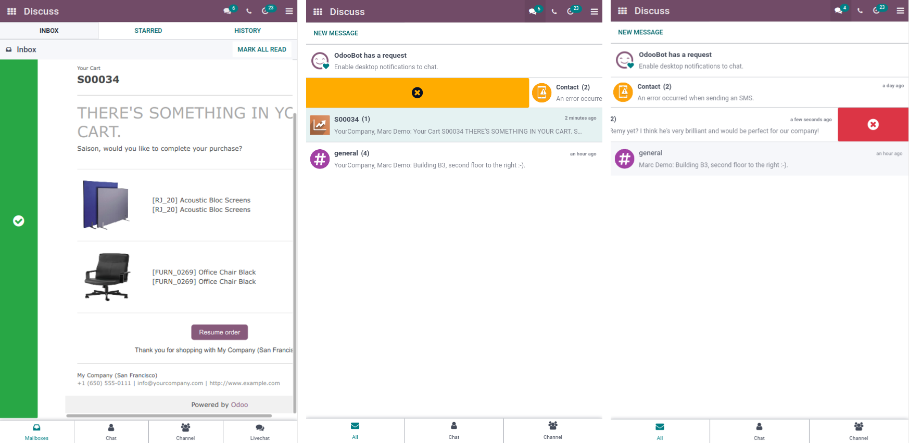

==================
Generic Components
==================

The Odoo web client is built with `Owl <https://github.com/odoo/owl>`_ components.
To make it easier, the Odoo javascript framework provides a suite of generic
components that can be reused in some common situations, such as dropdowns,
checkboxes or datepickers. This page explains how to use these generic components.

CheckBox
========

Location
--------

`@web/core/checkbox/checkbox`

Description
-----------

This is a simple checkbox component with a label next to it. The checkbox is
linked to the label: the checkbox is toggled whenever the label is clicked.

.. code-block:: xml

  <CheckBox value="boolean" disabled="boolean" t-on-change="onValueChange">
    Some Text
  </CheckBox>

Props
-----

.. list-table::
    :widths: 20 20 60
    :header-rows: 1

    * - Name 
      - Type
      - Description
    * - `value`
      - `boolean`
      - if true, the checkbox is checked, otherwise it is unchecked
    * - `disabled`
      - `boolean`
      - if true, the checkbox is disabled, otherwise it is enabled

ActionSwiper
========

.. note:: This component is a mobile feature, only supported in the Enterprise version of Odoo.

Location
--------

`@web_enterprise/core/action_swiper/action_swiper`

Description
-----------

This is a component that can perform actions when an element is swiped
horizontally. The swiper is wrapping a target element to add actions to it. 
The action is executed once the user has released the swiper passed
half of its width.

.. code-block:: xml

  <ActionSwiper onLeftSwipe="Object" onRightSwipe="Object">
    <SomeElement/>
  </ActionSwiper>

Usage
~~~~~~~

The simpliest way to use the component is to use it around your target element directly
in an xml template as shown above. But sometimes, you my want to extend an existing element
and would not want to duplicate the template. It is possible to do just that.

If you want to extend the behavior of an existing element, you must place the element
inside, by wrapping it directly. Also, you can conditionnally add props to manage when the
element might be swipable or not.

Example
~~~~~~~

The following example show you how you can use ``xpath``'s to wrap an existing
element in the ActionSwiper component. Here, a swiper has been added to mark
a message as read in mail.

.. code-block:: xml
    
  <xpath expr="//*[hasclass('o_Message')]" position="after">
    <ActionSwiper
      onRightSwipe="messaging.device.isMobile and messageView.message.isNeedaction ?
        {
          action: () => messageView.message.markAsRead(),
          icon: 'fa-check-circle',
          bgColor: 'bg-success',
        } : undefined"
    />
  </xpath>
  <xpath expr="//ActionSwiper" position="inside">
    <xpath expr="//*[hasclass('o_Message')]" position="move"/>
  </xpath>

Using the same principle, multiple existing elements have been extended to handle
swipe interactions.

.. note:: Actions are permuted when using right-to-left (RTL) languages.

Props
-----

.. list-table::
    :widths: 20 20 60
    :header-rows: 1

    * - Name 
      - Type
      - Description
    * - `onLeftSwipe`
      - `Object`
      - if present, the actionswiper can be swiped to the left
    * - `onRightSwipe`
      - `Object`
      - if present, the actionswiper can be swiped to the right

You can use both ``onLeftSwipe`` and ``onRightSwipe`` props at the same time.

Those ``Object``'s must contain:
    
    - ``action``, which is the callable ``Function`` serving as a callback.
      Once the swipe has been completed in the given direction, that action
      is performed.
    - ``icon`` is the icon class to use, usually to represent the action.
      It must be a ``string``.
    - ``bgColor`` is the background color, given to decorate the action.
      can be one of the following `bootstrap contextual color <https://getbootstrap.com/docs/3.3/components/#available-variations>`_ (``danger``,
      ``info``, ``secondary``, ``success`` or ``warning``).

    Those values must be given to define the behavior and the visual aspect
    of the swiper. 
